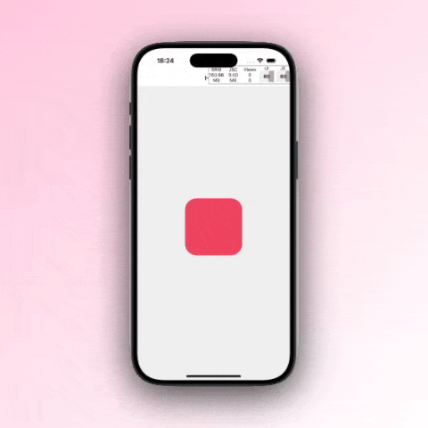

# expo-animated-portal

A React Native wrapper around native Swift [Portal](https://github.com/Aeastr/Portal) library for creating beautiful animated transitions between views. Built using Expo modules.

> ⚠️ **Warning**: This is an experimental package and not recommended for production use. Currently only works on iOS.




## Requirements
- iOS 15.0 or later
- Expo SDK 49 or later

## Credits
This project is a React Native wrapper around the [Portal](https://github.com/Aeastr/Portal) Swift library by [Aeastr](https://github.com/Aeastr).

## Installation

### Installation in managed Expo projects

```bash
npm install expo-animated-portal
```

### Installation in bare React Native projects

For bare React Native projects, you must ensure that you have [installed and configured the `expo` package](https://docs.expo.dev/bare/installing-expo-modules/) before continuing.

After installing `expo`:

```bash
npm install expo-animated-portal
```


## Documentation

*Absent for now 🫠*

## Usage

Here's a basic example of how to use the animated portal. See the [example app](./example/app/index.tsx) for a more complete example.

```tsx
import * as AnimatedPortal from "expo-animated-portal";
import React, { useState } from "react";
import { View, Pressable, SafeAreaView, Dimensions } from "react-native";

export default function App() {
  const [isModalVisible, setIsModalVisible] = useState(false);
  const { width, height } = Dimensions.get("window");

  return (
    <SafeAreaView style={{ flex: 1 }}>
      <View style={{ flex: 1, alignItems: "center", justifyContent: "center" }}>
        <AnimatedPortal.Root
          portalId="testExpoTransition"
          isActive={isModalVisible}
          style={{ width: 150, height: 150 }}
        >
          <AnimatedPortal.Transition>
            <ColoredBox />
          </AnimatedPortal.Transition>

          <AnimatedPortal.Source>
            <Pressable onPress={() => setIsModalVisible(!isModalVisible)}>
              <ColoredBox />
            </Pressable>
          </AnimatedPortal.Source>

          <AnimatedPortal.Sheet
            isOpened={isModalVisible}
            onIsOpenedChange={setIsModalVisible}
            style={{ width, height }}
          >
            <View style={{
              alignItems: "center",
              justifyContent: "center",
              paddingTop: 100,
            }}>
              <AnimatedPortal.Destination>
                <ColoredBox size={300} />
              </AnimatedPortal.Destination>
            </View>
          </AnimatedPortal.Sheet>
        </AnimatedPortal.Root>
      </View>
    </SafeAreaView>
  );
}

function ColoredBox({ size = 150 }) {
  return (
    <View
      style={{
        height: size,
        width: size,
        backgroundColor: "#EF445F",
        borderRadius: 30,
        alignItems: "center",
        justifyContent: "center",
      }}
    />
  );
}
```


## Contributing

Contributions are very welcome! Please feel free to submit a Pull Request.

## License

This project is licensed under the GNU General Public License v3.0 - see the [LICENSE](LICENSE) file for details.
